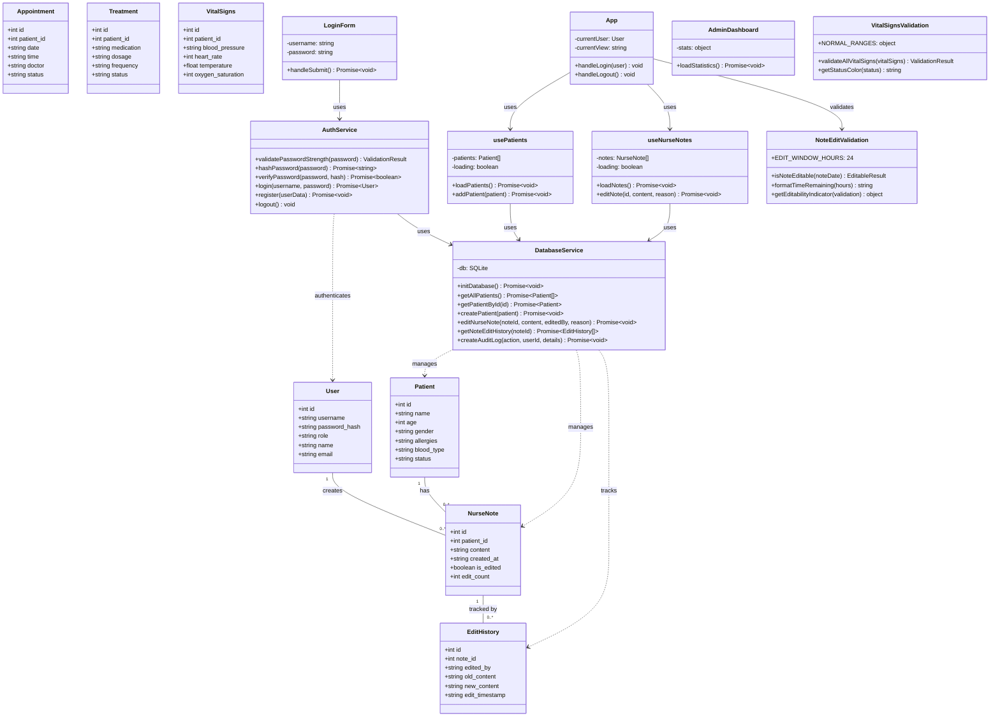

# UML Class Diagram - Sistema Hospitalario

## Overview
This document contains the UML class diagram for the Hospital Management System, showing the main classes, their relationships, and methods.

---

## PlantUML Diagram

```plantuml
@startuml Hospital Management System

skinparam classAttributeIconSize 0
skinparam monochrome false
skinparam shadowing false
skinparam packageStyle rectangle

' ==================== SERVICES LAYER ====================

package "Services Layer" #E8F5E9 {
    
    class DatabaseService {
        - db: SQLite
        --
        + initDatabase(): Promise<void>
        + executeSql(query: string, params: Array): Promise
        --
        ' Patient Operations
        + getAllPatients(): Promise<Patient[]>
        + getPatientById(id: number): Promise<Patient>
        + createPatient(patient: Patient): Promise<void>
        + updatePatient(id: number, patient: Patient): Promise<void>
        + deletePatient(id: number): Promise<void>
        --
        ' Appointment Operations
        + getAllAppointments(): Promise<Appointment[]>
        + getAppointmentsByPatientId(patientId: number): Promise<Appointment[]>
        + createAppointment(appointment: Appointment): Promise<void>
        + updateAppointment(id: number, appointment: Appointment): Promise<void>
        + deleteAppointment(id: number): Promise<void>
        --
        ' Treatment Operations
        + getAllTreatments(): Promise<Treatment[]>
        + getTreatmentsByPatientId(patientId: number): Promise<Treatment[]>
        + createTreatment(treatment: Treatment): Promise<void>
        + updateTreatment(id: number, treatment: Treatment): Promise<void>
        --
        ' Vital Signs Operations
        + getAllVitalSigns(): Promise<VitalSigns[]>
        + getVitalSignsByPatientId(patientId: number): Promise<VitalSigns[]>
        + createVitalSigns(vitalSigns: VitalSigns): Promise<void>
        --
        ' Nurse Notes Operations
        + getAllNurseNotes(): Promise<NurseNote[]>
        + getNurseNotesByPatientId(patientId: number): Promise<NurseNote[]>
        + createNurseNote(note: NurseNote): Promise<void>
        + editNurseNote(noteId: number, content: string, editedBy: string, reason: string): Promise<void>
        + getNoteEditHistory(noteId: number): Promise<EditHistory[]>
        + getAllNoteEditAttempts(filters: object): Promise<EditAttempt[]>
        + getNoteEditStats(): Promise<Stats>
        --
        ' Lab Tests Operations
        + getAllLabTests(): Promise<LabTest[]>
        + getLabTestsByPatientId(patientId: number): Promise<LabTest[]>
        + createLabTest(labTest: LabTest): Promise<void>
        + updateLabTest(id: number, labTest: LabTest): Promise<void>
        --
        ' Medical History Operations
        + getAllMedicalHistory(): Promise<MedicalHistory[]>
        + getMedicalHistoryByPatientId(patientId: number): Promise<MedicalHistory[]>
        + createMedicalHistory(history: MedicalHistory): Promise<void>
        --
        ' User Operations
        + getUserByUsername(username: string): Promise<User>
        + getUserByEmail(email: string): Promise<User>
        + createUser(userData: User): Promise<void>
        + updateLastLogin(userId: number): Promise<void>
        --
        ' Bed Management Operations
        + getAllBeds(): Promise<Bed[]>
        + getBedById(id: number): Promise<Bed>
        + updateBedStatus(id: number, status: string): Promise<void>
        + assignBedToPatient(bedId: number, patientId: number): Promise<void>
        --
        ' Audit Trail Operations
        + createAuditLog(action: string, userId: number, details: object): Promise<void>
        + getAuditLogs(filters: object): Promise<AuditLog[]>
        + logAllergyAlert(alertData: object): Promise<void>
    }
    
    class AuthService {
        --
        + validatePasswordStrength(password: string): ValidationResult
        + hashPassword(password: string): Promise<string>
        + verifyPassword(password: string, hash: string): Promise<boolean>
        --
        + login(username: string, password: string): Promise<User>
        + register(userData: User): Promise<void>
        + logout(): void
        + createDefaultUsers(): Promise<void>
        + resetPassword(email: string): Promise<void>
    }
}

' ==================== DOMAIN MODELS ====================

package "Domain Models" #FFF9C4 {
    
    class Patient {
        + id: number
        + name: string
        + age: number
        + gender: string
        + contact: string
        + address: string
        + allergies: string
        + blood_type: string
        + insurance: string
        + emergency_contact: string
        + emergency_phone: string
        + admission_date: string
        + discharge_date: string
        + status: string
        + medical_notes: string
        + assigned_nurse_id: number
        + assigned_doctor_id: number
    }
    
    class Appointment {
        + id: number
        + patient_id: number
        + date: string
        + time: string
        + doctor: string
        + reason: string
        + status: string
        + notes: string
        + department: string
        + priority: string
    }
    
    class Treatment {
        + id: number
        + patient_id: number
        + medication: string
        + dosage: string
        + frequency: string
        + start_date: string
        + end_date: string
        + prescribed_by: string
        + status: string
        + notes: string
    }
    
    class VitalSigns {
        + id: number
        + patient_id: number
        + blood_pressure: string
        + heart_rate: number
        + temperature: number
        + respiratory_rate: number
        + oxygen_saturation: number
        + glucose_level: number
        + weight: number
        + height: number
        + pain_level: number
        + recorded_by: string
        + recorded_at: string
        + notes: string
    }
    
    class NurseNote {
        + id: number
        + patient_id: number
        + nurse_id: number
        + nurse_name: string
        + shift: string
        + content: string
        + category: string
        + priority: string
        + created_at: string
        + updated_at: string
        + is_edited: boolean
        + edit_count: number
    }
    
    class LabTest {
        + id: number
        + patient_id: number
        + test_type: string
        + test_name: string
        + ordered_by: string
        + ordered_date: string
        + status: string
        + priority: string
        + results: string
        + result_date: string
        + technician: string
        + notes: string
    }
    
    class MedicalHistory {
        + id: number
        + patient_id: number
        + condition: string
        + diagnosed_date: string
        + treatment: string
        + status: string
        + notes: string
    }
    
    class User {
        + id: number
        + username: string
        + password_hash: string
        + role: string
        + name: string
        + email: string
        + phone: string
        + department: string
        + specialization: string
        + is_active: boolean
        + created_at: string
        + last_login: string
    }
    
    class Bed {
        + id: number
        + bed_number: string
        + ward: string
        + floor: number
        + bed_type: string
        + status: string
        + patient_id: number
        + assigned_date: string
        + notes: string
    }
    
    class AuditLog {
        + id: number
        + user_id: number
        + action: string
        + entity_type: string
        + entity_id: number
        + old_value: string
        + new_value: string
        + timestamp: string
        + ip_address: string
        + user_agent: string
    }
    
    class EditHistory {
        + id: number
        + note_id: number
        + edited_by: string
        + edited_by_role: string
        + edit_reason: string
        + old_content: string
        + new_content: string
        + edit_timestamp: string
        + time_since_creation: number
    }
}

' ==================== HOOKS LAYER ====================

package "React Hooks" #E1F5FE {
    
    class usePatients {
        - patients: Patient[]
        - loading: boolean
        - error: Error
        --
        + loadPatients(): Promise<void>
        + addPatient(patient: Patient): Promise<void>
        + updatePatient(id: number, patient: Patient): Promise<void>
        + removePatient(id: number): Promise<void>
    }
    
    class useAppointments {
        - appointments: Appointment[]
        - loading: boolean
        - error: Error
        --
        + loadAppointments(): Promise<void>
        + addAppointment(appointment: Appointment): Promise<void>
        + updateAppointment(id: number, appointment: Appointment): Promise<void>
        + removeAppointment(id: number): Promise<void>
    }
    
    class useTreatments {
        - treatments: Treatment[]
        - loading: boolean
        - error: Error
        --
        + loadTreatments(): Promise<void>
        + addTreatment(treatment: Treatment): Promise<void>
        + updateTreatment(id: number, treatment: Treatment): Promise<void>
    }
    
    class useVitalSigns {
        - vitalSigns: VitalSigns[]
        - loading: boolean
        - error: Error
        --
        + loadVitalSigns(): Promise<void>
        + addVitalSigns(vitalSigns: VitalSigns): Promise<void>
    }
    
    class useNurseNotes {
        - notes: NurseNote[]
        - loading: boolean
        - error: Error
        --
        + loadNotes(): Promise<void>
        + addNote(note: NurseNote): Promise<void>
        + editNote(id: number, content: string, reason: string): Promise<void>
        + getNoteHistory(id: number): Promise<EditHistory[]>
    }
}

' ==================== COMPONENTS LAYER ====================

package "React Components" #F3E5F5 {
    
    class App {
        - currentUser: User
        - currentView: string
        - showLogin: boolean
        - showRegister: boolean
        - sidebarOpen: boolean
        --
        + handleLogin(user: User): void
        + handleLogout(): void
        + handleRegister(userData: User): void
        + switchView(view: string): void
    }
    
    class LoginForm {
        - username: string
        - password: string
        - error: string
        --
        + handleSubmit(): Promise<void>
        + validateForm(): boolean
    }
    
    class RegisterForm {
        - formData: User
        - errors: object
        --
        + handleSubmit(): Promise<void>
        + validateForm(): boolean
        + checkPasswordStrength(): ValidationResult
    }
    
    class AdminDashboard {
        - stats: object
        - users: User[]
        --
        + loadStatistics(): Promise<void>
        + manageUsers(): void
        + viewAuditLogs(): void
    }
    
    class DoctorDashboard {
        - appointments: Appointment[]
        - patients: Patient[]
        --
        + viewAppointments(): void
        + viewPatientDetails(id: number): void
        + prescribeTreatment(treatment: Treatment): void
    }
    
    class EmergencyRoom {
        - emergencyPatients: Patient[]
        - triageQueue: Patient[]
        --
        + triagePatient(patient: Patient, priority: string): void
        + admitPatient(patient: Patient): void
    }
    
    class LabManagement {
        - labTests: LabTest[]
        - pendingTests: LabTest[]
        --
        + orderTest(test: LabTest): Promise<void>
        + recordResults(id: number, results: string): Promise<void>
        + updateStatus(id: number, status: string): Promise<void>
    }
    
    class PharmacyManagement {
        - medications: Treatment[]
        - inventory: object[]
        --
        + dispenseMedication(treatment: Treatment): void
        + checkInventory(medication: string): number
        + updateStock(medication: string, quantity: number): void
    }
    
    class BedManagement {
        - beds: Bed[]
        - availableBeds: Bed[]
        --
        + assignBed(bedId: number, patientId: number): Promise<void>
        + releaseBed(bedId: number): Promise<void>
        + getBedStatus(ward: string): Bed[]
    }
    
    class MessagingSystem {
        - messages: Message[]
        - conversations: Conversation[]
        --
        + sendMessage(message: Message): Promise<void>
        + loadMessages(): Promise<void>
        + markAsRead(id: number): Promise<void>
    }
    
    class NotificationCenter {
        - notifications: Notification[]
        - unreadCount: number
        --
        + loadNotifications(): Promise<void>
        + markAsRead(id: number): Promise<void>
        + dismissNotification(id: number): Promise<void>
    }
}

' ==================== UTILITIES ====================

package "Utilities" #FCE4EC {
    
    class NoteEditValidation {
        + EDIT_WINDOW_HOURS: number = 24
        --
        + isNoteEditable(noteDate: string): EditableResult
        + formatTimeRemaining(hours: number): string
        + getEditabilityIndicator(validation: object): IndicatorColors
        + validateEditAttempt(note: NurseNote, user: User): AuditData
        + getEditCountdown(noteDate: string): CountdownData
        + groupNotesByEditability(notes: NurseNote[]): GroupedNotes
    }
    
    class VitalSignsValidation {
        + NORMAL_RANGES: object
        --
        + validateAllVitalSigns(vitalSigns: VitalSigns): ValidationResult
        + getStatusColor(status: string): string
        + getStatusIcon(status: string): Icon
        + isValueInRange(value: number, range: object): boolean
    }
    
    class NurseAssignments {
        --
        + filterPatientsByAssignment(patients: Patient[], nurseId: number): Patient[]
        + getNurseAssignmentStats(patients: Patient[], nurseId: number): Stats
        + getAccessRestrictionMessage(patientId: number, nurseId: number): string
        + checkShiftStatus(shift: string): ShiftStatus
        + getCurrentShift(): string
    }
    
    class AllergyValidation {
        --
        + validateMedicationForPatient(medication: string, patient: Patient): AlertResult
        + generateAlertMessage(severity: string, allergies: string[]): string
        + getSeverityColors(severity: string): ColorScheme
        + getSeverityLabel(severity: string): string
        + formatAllergiesForDisplay(allergies: string): string[]
        + canOverrideAllergyWarning(severity: string, role: string): boolean
    }
    
    class PerformanceOptimizations {
        --
        + debounce(func: Function, delay: number): Function
        + throttle(func: Function, limit: number): Function
        + memoize(func: Function): Function
        + lazyLoad(component: Component): Component
    }
}

' ==================== RELATIONSHIPS ====================

' Services to Models
DatabaseService ..> Patient : manages
DatabaseService ..> Appointment : manages
DatabaseService ..> Treatment : manages
DatabaseService ..> VitalSigns : manages
DatabaseService ..> NurseNote : manages
DatabaseService ..> LabTest : manages
DatabaseService ..> MedicalHistory : manages
DatabaseService ..> User : manages
DatabaseService ..> Bed : manages
DatabaseService ..> AuditLog : creates
DatabaseService ..> EditHistory : tracks

AuthService ..> User : authenticates
AuthService --> DatabaseService : uses

' Hooks to Services
usePatients --> DatabaseService : uses
useAppointments --> DatabaseService : uses
useTreatments --> DatabaseService : uses
useVitalSigns --> DatabaseService : uses
useNurseNotes --> DatabaseService : uses

' Hooks to Models
usePatients ..> Patient : manages
useAppointments ..> Appointment : manages
useTreatments ..> Treatment : manages
useVitalSigns ..> VitalSigns : manages
useNurseNotes ..> NurseNote : manages

' Components to Hooks
App --> usePatients : uses
App --> useAppointments : uses
App --> useTreatments : uses
App --> useVitalSigns : uses
App --> useNurseNotes : uses

LoginForm --> AuthService : uses
RegisterForm --> AuthService : uses

AdminDashboard --> usePatients : uses
DoctorDashboard --> usePatients : uses
DoctorDashboard --> useAppointments : uses

EmergencyRoom --> usePatients : uses
LabManagement --> DatabaseService : uses
PharmacyManagement --> useTreatments : uses
BedManagement --> DatabaseService : uses

' Components to Utilities
App --> NoteEditValidation : validates
App --> AllergyValidation : validates
DoctorDashboard --> VitalSignsValidation : validates
EmergencyRoom --> NurseAssignments : filters

' Model Relationships
Patient "1" -- "0..*" Appointment : has
Patient "1" -- "0..*" Treatment : receives
Patient "1" -- "0..*" VitalSigns : monitored
Patient "1" -- "0..*" NurseNote : documented
Patient "1" -- "0..*" LabTest : undergoes
Patient "1" -- "0..*" MedicalHistory : has
Patient "0..1" -- "0..1" Bed : occupies

User "1" -- "0..*" NurseNote : creates
User "1" -- "0..*" AuditLog : generates

NurseNote "1" -- "0..*" EditHistory : tracked by

@enduml
```

---

## Mermaid Diagram (Alternative)



---

## Key Architecture Patterns

### 1. **Layered Architecture**
- **Presentation Layer**: React Components
- **Business Logic Layer**: React Hooks + Utilities
- **Data Access Layer**: Services (Database, Auth)
- **Domain Layer**: Models/Entities

### 2. **Repository Pattern**
- `DatabaseService` acts as a repository for all database operations
- Centralizes data access logic
- Provides abstraction over SQLite

### 3. **Service Pattern**
- `AuthService`: Handles authentication and authorization
- `DatabaseService`: Manages all CRUD operations

### 4. **Custom Hooks Pattern**
- Encapsulates state management and side effects
- Provides reusable data fetching logic
- Examples: `usePatients`, `useNurseNotes`, `useVitalSigns`

### 5. **Validation Pattern**
- Utility classes for domain-specific validation
- `NoteEditValidation`: Time-based edit restrictions (24h window)
- `VitalSignsValidation`: Medical parameter validation
- `AllergyValidation`: Medication safety checks

---

## Database Schema Summary

### Core Tables
- **patients**: Patient demographic and medical information
- **users**: System users (admin, doctors, nurses, patients)
- **appointments**: Medical appointments and scheduling
- **treatments**: Medication prescriptions and treatments
- **vital_signs**: Patient vital sign measurements
- **nurse_notes**: Nursing documentation with edit tracking
- **lab_tests**: Laboratory test orders and results
- **medical_history**: Patient medical history records
- **beds**: Hospital bed management

### Audit Tables
- **audit_logs**: System-wide audit trail (NOM-004 compliant)
- **note_edit_history**: Complete history of note edits
- **note_edit_attempts**: Log of all edit attempts (successful/failed)
- **allergy_alerts**: Medication allergy warnings log

---

## Security Features

1. **Password Validation**
   - Minimum 7 characters
   - At least 1 uppercase letter
   - At least 1 lowercase letter
   - At least 1 number
   - SHA-256 hashing

2. **Role-Based Access Control**
   - Admin: Full system access
   - Doctor: Patient care, prescriptions
   - Nurse: Documentation, vital signs
   - Patient: Personal records view

3. **Audit Trail**
   - All database operations logged
   - NOM-004 compliant audit logs
   - Edit history tracking

4. **Time-Based Restrictions**
   - Nurse notes editable only within 24 hours
   - Visual indicators (green/yellow/orange/red)
   - Complete edit attempt tracking

---

## Component Hierarchy

```
App
├── LoginForm
├── RegisterForm
├── AdminDashboard
│   ├── UserProfile
│   ├── AuditTrailViewer
│   └── ReportsAnalytics
├── DoctorDashboard
│   ├── AppointmentCalendar
│   ├── LabManagement
│   └── PharmacyManagement
├── EmergencyRoom
│   └── BedManagement
├── MessagingSystem
└── NotificationCenter
```

---

## How to Use This Diagram

### Option 1: PlantUML
1. Copy the PlantUML code
2. Visit: https://www.plantuml.com/plantuml/uml/
3. Paste the code
4. Generate PNG/SVG

### Option 2: Mermaid Live Editor
1. Copy the Mermaid code
2. Visit: https://mermaid.live/
3. Paste the code
4. Export as PNG/SVG

### Option 3: VS Code Extension
1. Install "PlantUML" or "Markdown Preview Mermaid Support" extension
2. Open this file
3. Preview the diagrams

---

## Notes

- **EDIT_WINDOW_HOURS = 24**: Nurse notes can only be edited within 24 hours of creation
- **NOM-004 Compliance**: All operations are audited per Mexican healthcare regulations
- **Allergy Validation**: System checks medication allergies before prescription
- **Shift-Based Access**: Nurses can only access patients assigned to their shift

