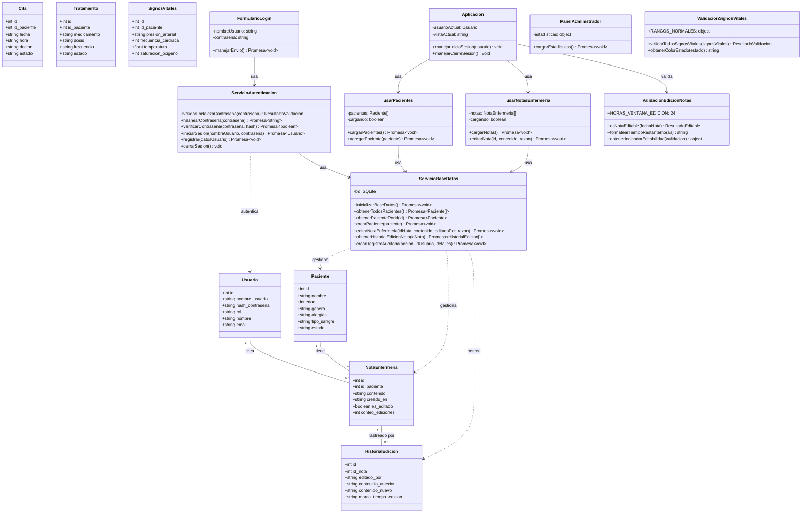

# Diagrama de Clases UML - Sistema Hospitalario

## Descripción General
Este documento contiene el diagrama de clases UML para el Sistema de Gestión Hospitalaria, mostrando las clases principales, sus relaciones y métodos.

---

## Diagrama PlantUML

```plantuml
@startuml Sistema de Gestión Hospitalaria

skinparam classAttributeIconSize 0
skinparam monochrome false
skinparam shadowing false
skinparam packageStyle rectangle

' ==================== CAPA DE SERVICIOS ====================

package "Capa de Servicios" #E8F5E9 {
    
    class ServicioBaseDatos {
        - bd: SQLite
        --
        + inicializarBaseDatos(): Promesa<void>
        + ejecutarSql(consulta: string, params: Array): Promesa
        --
        ' Operaciones de Pacientes
        + obtenerTodosPacientes(): Promesa<Paciente[]>
        + obtenerPacientePorId(id: number): Promesa<Paciente>
        + crearPaciente(paciente: Paciente): Promesa<void>
        + actualizarPaciente(id: number, paciente: Paciente): Promesa<void>
        + eliminarPaciente(id: number): Promesa<void>
        --
        ' Operaciones de Citas
        + obtenerTodasCitas(): Promesa<Cita[]>
        + obtenerCitasPorPacienteId(idPaciente: number): Promesa<Cita[]>
        + crearCita(cita: Cita): Promesa<void>
        + actualizarCita(id: number, cita: Cita): Promesa<void>
        + eliminarCita(id: number): Promesa<void>
        --
        ' Operaciones de Tratamientos
        + obtenerTodosTratamientos(): Promesa<Tratamiento[]>
        + obtenerTratamientosPorPacienteId(idPaciente: number): Promesa<Tratamiento[]>
        + crearTratamiento(tratamiento: Tratamiento): Promesa<void>
        + actualizarTratamiento(id: number, tratamiento: Tratamiento): Promesa<void>
        --
        ' Operaciones de Signos Vitales
        + obtenerTodosSignosVitales(): Promesa<SignosVitales[]>
        + obtenerSignosVitalesPorPacienteId(idPaciente: number): Promesa<SignosVitales[]>
        + crearSignosVitales(signosVitales: SignosVitales): Promesa<void>
        --
        ' Operaciones de Notas de Enfermería
        + obtenerTodasNotasEnfermeria(): Promesa<NotaEnfermeria[]>
        + obtenerNotasEnfermeriaPorPacienteId(idPaciente: number): Promesa<NotaEnfermeria[]>
        + crearNotaEnfermeria(nota: NotaEnfermeria): Promesa<void>
        + editarNotaEnfermeria(idNota: number, contenido: string, editadoPor: string, razon: string): Promesa<void>
        + obtenerHistorialEdicionNota(idNota: number): Promesa<HistorialEdicion[]>
        + obtenerTodosIntentosEdicionNota(filtros: object): Promesa<IntentoEdicion[]>
        + obtenerEstadisticasEdicionNotas(): Promesa<Estadisticas>
        --
        ' Operaciones de Pruebas de Laboratorio
        + obtenerTodasPruebasLaboratorio(): Promesa<PruebaLaboratorio[]>
        + obtenerPruebasLaboratorioPorPacienteId(idPaciente: number): Promesa<PruebaLaboratorio[]>
        + crearPruebaLaboratorio(prueba: PruebaLaboratorio): Promesa<void>
        + actualizarPruebaLaboratorio(id: number, prueba: PruebaLaboratorio): Promesa<void>
        --
        ' Operaciones de Historial Médico
        + obtenerTodoHistorialMedico(): Promesa<HistorialMedico[]>
        + obtenerHistorialMedicoPorPacienteId(idPaciente: number): Promesa<HistorialMedico[]>
        + crearHistorialMedico(historial: HistorialMedico): Promesa<void>
        --
        ' Operaciones de Usuarios
        + obtenerUsuarioPorNombre(nombreUsuario: string): Promesa<Usuario>
        + obtenerUsuarioPorEmail(email: string): Promesa<Usuario>
        + crearUsuario(datosUsuario: Usuario): Promesa<void>
        + actualizarUltimoAcceso(idUsuario: number): Promesa<void>
        --
        ' Operaciones de Gestión de Camas
        + obtenerTodasCamas(): Promesa<Cama[]>
        + obtenerCamaPorId(id: number): Promesa<Cama>
        + actualizarEstadoCama(id: number, estado: string): Promesa<void>
        + asignarCamaAPaciente(idCama: number, idPaciente: number): Promesa<void>
        --
        ' Operaciones de Auditoría
        + crearRegistroAuditoria(accion: string, idUsuario: number, detalles: object): Promesa<void>
        + obtenerRegistrosAuditoria(filtros: object): Promesa<RegistroAuditoria[]>
        + registrarAlertaAlergia(datosAlerta: object): Promesa<void>
    }
    
    class ServicioAutenticacion {
        --
        + validarFortalezaContrasena(contrasena: string): ResultadoValidacion
        + hashearContrasena(contrasena: string): Promesa<string>
        + verificarContrasena(contrasena: string, hash: string): Promesa<boolean>
        --
        + iniciarSesion(nombreUsuario: string, contrasena: string): Promesa<Usuario>
        + registrar(datosUsuario: Usuario): Promesa<void>
        + cerrarSesion(): void
        + crearUsuariosPorDefecto(): Promesa<void>
        + restablecerContrasena(email: string): Promesa<void>
    }
}

' ==================== MODELOS DE DOMINIO ====================

package "Modelos de Dominio" #FFF9C4 {
    
    class Paciente {
        + id: numero
        + nombre: string
        + edad: numero
        + genero: string
        + contacto: string
        + direccion: string
        + alergias: string
        + tipo_sangre: string
        + seguro: string
        + contacto_emergencia: string
        + telefono_emergencia: string
        + fecha_admision: string
        + fecha_alta: string
        + estado: string
        + notas_medicas: string
        + id_enfermera_asignada: numero
        + id_doctor_asignado: numero
    }
    
    class Cita {
        + id: numero
        + id_paciente: numero
        + fecha: string
        + hora: string
        + doctor: string
        + motivo: string
        + estado: string
        + notas: string
        + departamento: string
        + prioridad: string
    }
    
    class Tratamiento {
        + id: numero
        + id_paciente: numero
        + medicamento: string
        + dosis: string
        + frecuencia: string
        + fecha_inicio: string
        + fecha_fin: string
        + prescrito_por: string
        + estado: string
        + notas: string
    }
    
    class SignosVitales {
        + id: numero
        + id_paciente: numero
        + presion_arterial: string
        + frecuencia_cardiaca: numero
        + temperatura: numero
        + frecuencia_respiratoria: numero
        + saturacion_oxigeno: numero
        + nivel_glucosa: numero
        + peso: numero
        + altura: numero
        + nivel_dolor: numero
        + registrado_por: string
        + registrado_en: string
        + notas: string
    }
    
    class NotaEnfermeria {
        + id: numero
        + id_paciente: numero
        + id_enfermera: numero
        + nombre_enfermera: string
        + turno: string
        + contenido: string
        + categoria: string
        + prioridad: string
        + creado_en: string
        + actualizado_en: string
        + es_editado: boolean
        + conteo_ediciones: numero
    }
    
    class PruebaLaboratorio {
        + id: numero
        + id_paciente: numero
        + tipo_prueba: string
        + nombre_prueba: string
        + ordenado_por: string
        + fecha_orden: string
        + estado: string
        + prioridad: string
        + resultados: string
        + fecha_resultado: string
        + tecnico: string
        + notas: string
    }
    
    class HistorialMedico {
        + id: numero
        + id_paciente: numero
        + condicion: string
        + fecha_diagnostico: string
        + tratamiento: string
        + estado: string
        + notas: string
    }
    
    class Usuario {
        + id: numero
        + nombre_usuario: string
        + hash_contrasena: string
        + rol: string
        + nombre: string
        + email: string
        + telefono: string
        + departamento: string
        + especializacion: string
        + esta_activo: boolean
        + creado_en: string
        + ultimo_acceso: string
    }
    
    class Cama {
        + id: numero
        + numero_cama: string
        + sala: string
        + piso: numero
        + tipo_cama: string
        + estado: string
        + id_paciente: numero
        + fecha_asignacion: string
        + notas: string
    }
    
    class RegistroAuditoria {
        + id: numero
        + id_usuario: numero
        + accion: string
        + tipo_entidad: string
        + id_entidad: numero
        + valor_anterior: string
        + valor_nuevo: string
        + marca_tiempo: string
        + direccion_ip: string
        + agente_usuario: string
    }
    
    class HistorialEdicion {
        + id: numero
        + id_nota: numero
        + editado_por: string
        + rol_editor: string
        + razon_edicion: string
        + contenido_anterior: string
        + contenido_nuevo: string
        + marca_tiempo_edicion: string
        + tiempo_desde_creacion: numero
    }
}

' ==================== CAPA DE HOOKS ====================

package "Hooks de React" #E1F5FE {
    
    class usarPacientes {
        - pacientes: Paciente[]
        - cargando: boolean
        - error: Error
        --
        + cargarPacientes(): Promesa<void>
        + agregarPaciente(paciente: Paciente): Promesa<void>
        + actualizarPaciente(id: numero, paciente: Paciente): Promesa<void>
        + eliminarPaciente(id: numero): Promesa<void>
    }
    
    class usarCitas {
        - citas: Cita[]
        - cargando: boolean
        - error: Error
        --
        + cargarCitas(): Promesa<void>
        + agregarCita(cita: Cita): Promesa<void>
        + actualizarCita(id: numero, cita: Cita): Promesa<void>
        + eliminarCita(id: numero): Promesa<void>
    }
    
    class usarTratamientos {
        - tratamientos: Tratamiento[]
        - cargando: boolean
        - error: Error
        --
        + cargarTratamientos(): Promesa<void>
        + agregarTratamiento(tratamiento: Tratamiento): Promesa<void>
        + actualizarTratamiento(id: numero, tratamiento: Tratamiento): Promesa<void>
    }
    
    class usarSignosVitales {
        - signosVitales: SignosVitales[]
        - cargando: boolean
        - error: Error
        --
        + cargarSignosVitales(): Promesa<void>
        + agregarSignosVitales(signosVitales: SignosVitales): Promesa<void>
    }
    
    class usarNotasEnfermeria {
        - notas: NotaEnfermeria[]
        - cargando: boolean
        - error: Error
        --
        + cargarNotas(): Promesa<void>
        + agregarNota(nota: NotaEnfermeria): Promesa<void>
        + editarNota(id: numero, contenido: string, razon: string): Promesa<void>
        + obtenerHistorialNota(id: numero): Promesa<HistorialEdicion[]>
    }
}

' ==================== CAPA DE COMPONENTES ====================

package "Componentes de React" #F3E5F5 {
    
    class Aplicacion {
        - usuarioActual: Usuario
        - vistaActual: string
        - mostrarLogin: boolean
        - mostrarRegistro: boolean
        - barraLateralAbierta: boolean
        --
        + manejarInicioSesion(usuario: Usuario): void
        + manejarCierreSesion(): void
        + manejarRegistro(datosUsuario: Usuario): void
        + cambiarVista(vista: string): void
    }
    
    class FormularioLogin {
        - nombreUsuario: string
        - contrasena: string
        - error: string
        --
        + manejarEnvio(): Promesa<void>
        + validarFormulario(): boolean
    }
    
    class FormularioRegistro {
        - datosFormulario: Usuario
        - errores: object
        --
        + manejarEnvio(): Promesa<void>
        + validarFormulario(): boolean
        + verificarFortalezaContrasena(): ResultadoValidacion
    }
    
    class PanelAdministrador {
        - estadisticas: object
        - usuarios: Usuario[]
        --
        + cargarEstadisticas(): Promesa<void>
        + gestionarUsuarios(): void
        + verRegistrosAuditoria(): void
    }
    
    class PanelDoctor {
        - citas: Cita[]
        - pacientes: Paciente[]
        --
        + verCitas(): void
        + verDetallesPaciente(id: numero): void
        + prescribirTratamiento(tratamiento: Tratamiento): void
    }
    
    class SalaEmergencias {
        - pacientesEmergencia: Paciente[]
        - colaTriaje: Paciente[]
        --
        + clasificarPaciente(paciente: Paciente, prioridad: string): void
        + admitirPaciente(paciente: Paciente): void
    }
    
    class GestionLaboratorio {
        - pruebasLab: PruebaLaboratorio[]
        - pruebasPendientes: PruebaLaboratorio[]
        --
        + ordenarPrueba(prueba: PruebaLaboratorio): Promesa<void>
        + registrarResultados(id: numero, resultados: string): Promesa<void>
        + actualizarEstado(id: numero, estado: string): Promesa<void>
    }
    
    class GestionFarmacia {
        - medicamentos: Tratamiento[]
        - inventario: object[]
        --
        + dispensarMedicamento(tratamiento: Tratamiento): void
        + verificarInventario(medicamento: string): numero
        + actualizarStock(medicamento: string, cantidad: numero): void
    }
    
    class GestionCamas {
        - camas: Cama[]
        - camasDisponibles: Cama[]
        --
        + asignarCama(idCama: numero, idPaciente: numero): Promesa<void>
        + liberarCama(idCama: numero): Promesa<void>
        + obtenerEstadoCama(sala: string): Cama[]
    }
    
    class SistemaMensajeria {
        - mensajes: Mensaje[]
        - conversaciones: Conversacion[]
        --
        + enviarMensaje(mensaje: Mensaje): Promesa<void>
        + cargarMensajes(): Promesa<void>
        + marcarComoLeido(id: numero): Promesa<void>
    }
    
    class CentroNotificaciones {
        - notificaciones: Notificacion[]
        - conteoNoLeidas: numero
        --
        + cargarNotificaciones(): Promesa<void>
        + marcarComoLeida(id: numero): Promesa<void>
        + descartarNotificacion(id: numero): Promesa<void>
    }
}

' ==================== UTILIDADES ====================

package "Utilidades" #FCE4EC {
    
    class ValidacionEdicionNotas {
        + HORAS_VENTANA_EDICION: numero = 24
        --
        + esNotaEditable(fechaNota: string): ResultadoEditable
        + formatearTiempoRestante(horas: numero): string
        + obtenerIndicadorEditabilidad(validacion: object): ColoresIndicador
        + validarIntentoEdicion(nota: NotaEnfermeria, usuario: Usuario): DatosAuditoria
        + obtenerCuentaRegresiva(fechaNota: string): DatosCuentaRegresiva
        + agruparNotasPorEditabilidad(notas: NotaEnfermeria[]): NotasAgrupadas
    }
    
    class ValidacionSignosVitales {
        + RANGOS_NORMALES: object
        --
        + validarTodosSignosVitales(signosVitales: SignosVitales): ResultadoValidacion
        + obtenerColorEstado(estado: string): string
        + obtenerIconoEstado(estado: string): Icono
        + esValorEnRango(valor: numero, rango: object): boolean
    }
    
    class AsignacionesEnfermeria {
        --
        + filtrarPacientesPorAsignacion(pacientes: Paciente[], idEnfermera: numero): Paciente[]
        + obtenerEstadisticasAsignacion(pacientes: Paciente[], idEnfermera: numero): Estadisticas
        + obtenerMensajeRestriccionAcceso(idPaciente: numero, idEnfermera: numero): string
        + verificarEstadoTurno(turno: string): EstadoTurno
        + obtenerTurnoActual(): string
    }
    
    class ValidacionAlergias {
        --
        + validarMedicamentoParaPaciente(medicamento: string, paciente: Paciente): ResultadoAlerta
        + generarMensajeAlerta(severidad: string, alergias: string[]): string
        + obtenerColoresSeveridad(severidad: string): EsquemaColor
        + obtenerEtiquetaSeveridad(severidad: string): string
        + formatearAlergiasParaMostrar(alergias: string): string[]
        + puedeAnularAdvertenciaAlergia(severidad: string, rol: string): boolean
    }
    
    class OptimizacionesRendimiento {
        --
        + antirrebote(func: Funcion, retraso: numero): Funcion
        + limitador(func: Funcion, limite: numero): Funcion
        + memoizar(func: Funcion): Funcion
        + cargaPerezosa(componente: Componente): Componente
    }
}

' ==================== RELACIONES ====================

' Servicios a Modelos
ServicioBaseDatos ..> Paciente : gestiona
ServicioBaseDatos ..> Cita : gestiona
ServicioBaseDatos ..> Tratamiento : gestiona
ServicioBaseDatos ..> SignosVitales : gestiona
ServicioBaseDatos ..> NotaEnfermeria : gestiona
ServicioBaseDatos ..> PruebaLaboratorio : gestiona
ServicioBaseDatos ..> HistorialMedico : gestiona
ServicioBaseDatos ..> Usuario : gestiona
ServicioBaseDatos ..> Cama : gestiona
ServicioBaseDatos ..> RegistroAuditoria : crea
ServicioBaseDatos ..> HistorialEdicion : rastrea

ServicioAutenticacion ..> Usuario : autentica
ServicioAutenticacion --> ServicioBaseDatos : usa

' Hooks a Servicios
usarPacientes --> ServicioBaseDatos : usa
usarCitas --> ServicioBaseDatos : usa
usarTratamientos --> ServicioBaseDatos : usa
usarSignosVitales --> ServicioBaseDatos : usa
usarNotasEnfermeria --> ServicioBaseDatos : usa

' Hooks a Modelos
usarPacientes ..> Paciente : gestiona
usarCitas ..> Cita : gestiona
usarTratamientos ..> Tratamiento : gestiona
usarSignosVitales ..> SignosVitales : gestiona
usarNotasEnfermeria ..> NotaEnfermeria : gestiona

' Componentes a Hooks
Aplicacion --> usarPacientes : usa
Aplicacion --> usarCitas : usa
Aplicacion --> usarTratamientos : usa
Aplicacion --> usarSignosVitales : usa
Aplicacion --> usarNotasEnfermeria : usa

FormularioLogin --> ServicioAutenticacion : usa
FormularioRegistro --> ServicioAutenticacion : usa

PanelAdministrador --> usarPacientes : usa
PanelDoctor --> usarPacientes : usa
PanelDoctor --> usarCitas : usa

SalaEmergencias --> usarPacientes : usa
GestionLaboratorio --> ServicioBaseDatos : usa
GestionFarmacia --> usarTratamientos : usa
GestionCamas --> ServicioBaseDatos : usa

' Componentes a Utilidades
Aplicacion --> ValidacionEdicionNotas : valida
Aplicacion --> ValidacionAlergias : valida
PanelDoctor --> ValidacionSignosVitales : valida
SalaEmergencias --> AsignacionesEnfermeria : filtra

' Relaciones de Modelos
Paciente "1" -- "0..*" Cita : tiene
Paciente "1" -- "0..*" Tratamiento : recibe
Paciente "1" -- "0..*" SignosVitales : monitorizado
Paciente "1" -- "0..*" NotaEnfermeria : documentado
Paciente "1" -- "0..*" PruebaLaboratorio : realiza
Paciente "1" -- "0..*" HistorialMedico : tiene
Paciente "0..1" -- "0..1" Cama : ocupa

Usuario "1" -- "0..*" NotaEnfermeria : crea
Usuario "1" -- "0..*" RegistroAuditoria : genera

NotaEnfermeria "1" -- "0..*" HistorialEdicion : rastreado por

@enduml
```

---

## Diagrama Mermaid (Alternativo)



---

## Patrones de Arquitectura Clave

### 1. **Arquitectura en Capas**
- **Capa de Presentación**: Componentes React
- **Capa de Lógica de Negocio**: Hooks de React + Utilidades
- **Capa de Acceso a Datos**: Servicios (Database, Auth)
- **Capa de Dominio**: Modelos/Entidades

### 2. **Patrón Repository**
- `ServicioBaseDatos` actúa como repositorio para todas las operaciones de base de datos
- Centraliza la lógica de acceso a datos
- Proporciona abstracción sobre SQLite

### 3. **Patrón Service**
- `ServicioAutenticacion`: Maneja autenticación y autorización
- `ServicioBaseDatos`: Gestiona todas las operaciones CRUD

### 4. **Patrón Custom Hooks**
- Encapsula la gestión de estado y efectos secundarios
- Proporciona lógica reutilizable de obtención de datos
- Ejemplos: `usarPacientes`, `usarNotasEnfermeria`, `usarSignosVitales`

### 5. **Patrón Validation**
- Clases de utilidad para validación específica del dominio
- `ValidacionEdicionNotas`: Restricciones de edición basadas en tiempo (ventana de 24h)
- `ValidacionSignosVitales`: Validación de parámetros médicos
- `ValidacionAlergias`: Verificaciones de seguridad de medicamentos

---

## Resumen del Esquema de Base de Datos

### Tablas Principales
- **pacientes**: Información demográfica y médica del paciente
- **usuarios**: Usuarios del sistema (admin, doctores, enfermeras, pacientes)
- **citas**: Citas médicas y programación
- **tratamientos**: Prescripciones de medicamentos y tratamientos
- **signos_vitales**: Mediciones de signos vitales del paciente
- **notas_enfermeria**: Documentación de enfermería con seguimiento de ediciones
- **pruebas_laboratorio**: Órdenes y resultados de pruebas de laboratorio
- **historial_medico**: Registros del historial médico del paciente
- **camas**: Gestión de camas hospitalarias

### Tablas de Auditoría
- **registros_auditoria**: Rastro de auditoría de todo el sistema (cumple NOM-004)
- **historial_edicion_notas**: Historial completo de ediciones de notas
- **intentos_edicion_notas**: Registro de todos los intentos de edición (exitosos/fallidos)
- **alertas_alergias**: Registro de advertencias de alergias a medicamentos

---

## Características de Seguridad

1. **Validación de Contraseñas**
   - Mínimo 7 caracteres
   - Al menos 1 letra mayúscula
   - Al menos 1 letra minúscula
   - Al menos 1 número
   - Hash SHA-256

2. **Control de Acceso Basado en Roles**
   - Admin: Acceso completo al sistema
   - Doctor: Atención al paciente, prescripciones
   - Enfermera: Documentación, signos vitales
   - Paciente: Vista de registros personales

3. **Rastro de Auditoría**
   - Todas las operaciones de base de datos registradas
   - Registros de auditoría conformes a NOM-004
   - Seguimiento del historial de ediciones

4. **Restricciones Basadas en Tiempo**
   - Notas de enfermería editables solo dentro de 24 horas
   - Indicadores visuales (verde/amarillo/naranja/rojo)
   - Seguimiento completo de intentos de edición

---

## Jerarquía de Componentes

```
Aplicacion
├── FormularioLogin
├── FormularioRegistro
├── PanelAdministrador
│   ├── PerfilUsuario
│   ├── VisorRastroAuditoria
│   └── ReportesAnaliticas
├── PanelDoctor
│   ├── CalendarioCitas
│   ├── GestionLaboratorio
│   └── GestionFarmacia
├── SalaEmergencias
│   └── GestionCamas
├── SistemaMensajeria
└── CentroNotificaciones
```

---

## Cómo Usar Este Diagrama

### Opción 1: PlantUML
1. Copiar el código PlantUML
2. Visitar: https://www.plantuml.com/plantuml/uml/
3. Pegar el código
4. Generar PNG/SVG

### Opción 2: Editor en Línea Mermaid
1. Copiar el código Mermaid
2. Visitar: https://mermaid.live/
3. Pegar el código
4. Exportar como PNG/SVG

### Opción 3: Extensión de VS Code
1. Instalar la extensión "PlantUML" o "Markdown Preview Mermaid Support"
2. Abrir este archivo
3. Previsualizar los diagramas

---

## Notas

- **HORAS_VENTANA_EDICION = 24**: Las notas de enfermería solo se pueden editar dentro de las 24 horas posteriores a su creación
- **Cumplimiento NOM-004**: Todas las operaciones se auditan según las regulaciones de salud mexicanas
- **Validación de Alergias**: El sistema verifica las alergias a medicamentos antes de la prescripción
- **Acceso Basado en Turnos**: Las enfermeras solo pueden acceder a los pacientes asignados a su turno
